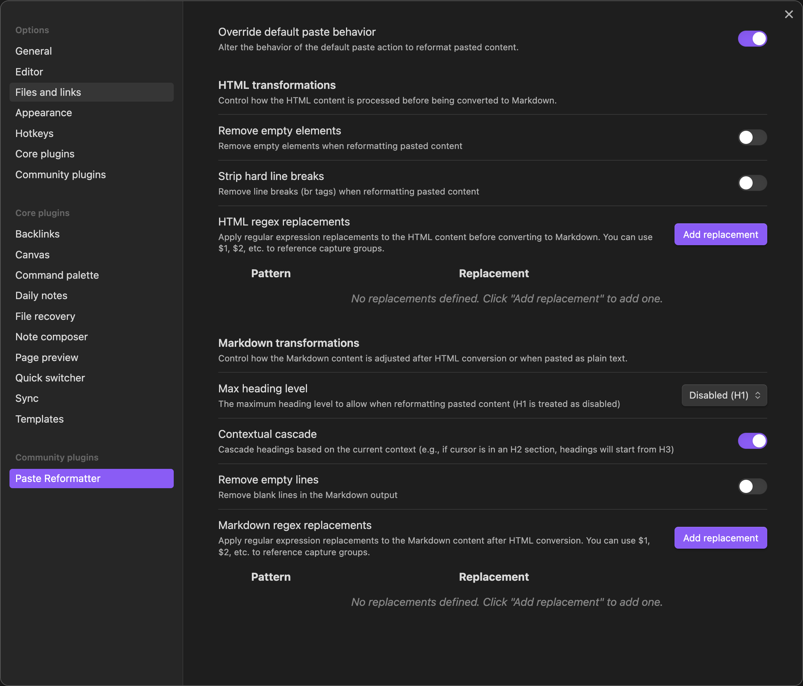

# Paste Reformatter

A plugin for [Obsidian](https://obsidian.md) that reformats pasted HTML and plain text content, giving you precise control over how content is transformed when pasted into your notes.

* Use RegEx to transform HTML and Markdown.
* Reformat HTML before converting to Markdown for better formatting results.
* Automatically adjust pasted heading levels to match content.
* Strip blank lines and elements.

## Installation

### From Obsidian Community Plugins

1. Open Obsidian and go to **Settings**
2. Navigate to **Community plugins** and disable **Safe mode** if it's enabled
3. Click **Browse** and search for "Paste Reformatter"
4. Click **Install**, then **Enable** to activate the plugin

### Manual Installation

1. Download the latest release from the [GitHub releases page](https://github.com/keathmilligan/obsidian-paste-reformatter/releases)
2. Extract the ZIP file to your Obsidian plugins folder: `<vault>/.obsidian/plugins/`
3. Reload Obsidian or restart the app
4. Go to **Settings** > **Community plugins** and enable "Paste Reformatter"

## Usage

The Paste Reformatter plugin automatically processes content when you paste it into your notes using `Ctrl+V` (or `Cmd+V` on macOS). The plugin:

1. Detects whether the clipboard contains HTML or plain text
2. For HTML content:
   - Applies HTML transformations (optionally removing empty elements or hard line breaks, regex string replacement)
   - Converts the HTML to Markdown
3. For plain text:
   - Treats it as already being in Markdown format
4. Applies Markdown transformations (heading adjustments, line break handling, regex string replacement)
5. Inserts the transformed content at the cursor position

A notification will appear briefly indicating whether HTML or plain text content was reformatted.

### Commands

> Note: commands are prefixed with "Paste Reformatter:" in the hot-key list.

|Command|Description|
|-|-|
|**Reformat and Paste**|By default, Paste Reformatter overrides Obsidian's normal paste behavior. Alternatively, you can disable this behavior (see below) and bind a hot-key to this command.|
|**Paste with Escaped Markdown**|Pastes text with all markdown escaped. For example, `[Data]` becomes `\[Data]`.

### Potential Conflicts

Paste Reformatter can potentially conflict with other Obsidian plugins that override the default paste behavior. To mitigate this, Paste Reformatter will only prevent the default handling of the paste event if it actually performs a transformation on the pasted text. Otherwise, it will allow the default behavior to take place. This won't prevent all potential collisions, however. So if you run into problems, disable "Override default paste behavior" and bind a hotkey to the "Paste and Reformat" command. 

## Configuration

### General Settings

#### Override default paste behavior

When this setting is enabled, the default behavior of Obsidian's Paste function will be enhanced. Otherwise,
**Reformat and Paste** command can be bound to an alternative hot-key to get enhanced paste behavior.

### HTML Transformations

These settings control how HTML content is processed before being converted to Markdown.

#### Remove Empty Elements

When enabled, this setting removes empty elements (such as empty paragraphs, divs, spans) from the pasted HTML. This helps clean up content that might contain unnecessary structural elements.

Elements with meaningful content (including images, horizontal rules, etc.) are preserved even when empty.

#### Strip Hard Line Breaks

When enabled, this setting removes ` ` tags from the HTML, resulting in paragraph-style text flow. When disabled, line breaks are preserved in the resulting Markdown.

#### HTML Regex Replacements

This feature allows you to define custom regular expression patterns and replacements to apply to the HTML content before it's converted to Markdown.

Each replacement consists of:
- **Pattern**: A regular expression to match in the HTML
- **Replacement**: The text to replace the matched pattern with

You can use capture groups in your patterns and reference them in the replacement using `$1`, `$2`, etc.

### Markdown Transformations

These settings control how the Markdown content is processed after HTML conversion (or directly for plain text).

#### Max Heading Level

This setting controls the maximum heading level that will be applied to pasted headings. 

The value is an integer between 1 and 6, where:
- H1 (level 1) is treated as disabled (no heading adjustments)
- H2-H6 (levels 2-6) will enforce that heading level as the minimum

When set to a value other than H1 (disabled), headings that are shallower than the specified level will be increased to that level.

#### Cascade Heading Levels

When enabled, this option preserves the heading hierarchy by cascading levels based on the Max Heading Level setting.

For example, if Max Heading Level is set to H2:

- H1 (#) becomes H2 (##)
- H2 (##) becomes H3 (###)
- H3 (###) becomes H4 (####)
- H4 (####) becomes H5 (#####)
- H5 (#####) becomes H6 (######)
- H6 (######) remains H6 (######) (capped at H6)

This preserves the relative structure of your headings while ensuring they fit within your document's hierarchy.

This setting is only available when Max Heading Level is set to something other than H1 (disabled).

#### Contextual Cascade

When enabled, this option adjusts heading levels based on the current context in your document. The plugin detects the heading level at your cursor position and cascades pasted headings relative to that context.

For example, if your cursor is positioned in a section with an H2 heading:

- Pasted H1 headings will become H3 (one level deeper than the context)
- Pasted H2 headings will become H4
- Pasted H3 headings will become H5
- And so on (capped at H6)

This is particularly useful when pasting content into different sections of your document and wanting the heading structure to fit naturally within the current section's hierarchy.

When used together with Cascade Heading Levels, the relative hierarchy of headings in the pasted content will be preserved.

#### Remove Empty Lines

When enabled, this setting removes blank lines from the Markdown output, resulting in more compact content. When disabled, empty lines are preserved, maintaining the original spacing.

#### Markdown Regex Replacements

Similar to HTML Regex Replacements, this feature allows you to define custom regular expression patterns and replacements to apply to the Markdown content after conversion.

This is useful for:
- Standardizing formatting
- Removing unwanted patterns
- Transforming specific content structures
- Adding custom Obsidian-specific syntax

## Examples

### Example 1: Cleaning Up Web Content

When copying content from websites, you often get unwanted elements. With these settings:
- Remove Empty Elements: Enabled
- Strip Hard Line Breaks: Enabled
- Max Heading Level: H2
- Cascade Heading Levels: Enabled

A complex web article with various heading levels and formatting will be transformed into clean, hierarchical Markdown with H2 as the top-level heading.

### Example 2: Preserving Document Structure

When copying content from a document with specific formatting:
- Remove Empty Elements: Disabled
- Strip Hard Line Breaks: Disabled
- Max Heading Level: H1 (Disabled)
- Contextual Cascade: Enabled

The content will maintain its original structure, but headings will be adjusted to fit within the current document's hierarchy based on your cursor position.

### HTML Regex Replacement Examples

1. **Remove image width/height attributes**
    - Pattern: `(]*)(width|height)="[^"]*"`
    - Replacement: `$1`
    - Description: Removes width and height attributes from image tags, allowing them to be sized by CSS instead
2. **Convert Google Docs span styles to semantic elements**
    - Pattern: `(.*?)`
    - Replacement: `<strong>$1</strong>`
    - Description: Converts Google Docs styled spans to proper HTML elements
3. **Fix Microsoft Word's special quotes**
    - Pattern: `(&#8220;|&#8221;)`
    - Replacement: `"`
    - Description: Replaces curly quotes with straight quotes for better compatibility
4. **Remove class attributes**
    - Pattern: `\s*class="[^"]*"`
    - Replacement: ``
    - Description: Strips class attributes that might contain website-specific styling
5. **Convert div tags to paragraphs**
    - Pattern: `<div([^>]*)>(.*?)
`
    - Replacement: `<p$1>$2
`
    - Description: Converts div elements to paragraph elements for cleaner Markdown conversion

### Markdown Regex Replacement Examples

1. **Add callouts to blockquotes starting with Note:**
    - Pattern: `> Note:(.*?)(\n\n|\n$)`
    - Replacement: `> [!note]$1$2`
    - Description: Converts simple note blockquotes to Obsidian callouts
2. **Convert URL references to Obsidian wiki links**
    - Pattern: `\[([^\]]+)\]\(https://en.wikipedia.org/wiki/([^\)]+)\)`
    - Replacement: `[[$2|$1]]`
    - Description: Transforms Wikipedia links to Obsidian wiki links
3. **Add tags to headings with specific keywords**
    - Pattern: `^(#+\s*.*?)(TODO|REVIEW|IMPORTANT)(.*)$`
    - Replacement: `$1$2$3 #task`
    - Description: Adds a task tag to headings containing action keywords
4. **Format dates consistently**
    - Pattern: `(\d{1,2})/(\d{1,2})/(\d{4})`
    - Replacement: `$3-$1-$2`
    - Description: Converts MM/DD/YYYY dates to YYYY-MM-DD format
5. **Convert asterisk lists to dash lists**
    - Pattern: `^(\s*)\*`
    - Replacement: `$1-`
    - Description: Standardizes list formatting to use dashes instead of asterisks

## License

This project is licensed under the BSD Zero Clause License - see the LICENSE file for details.
